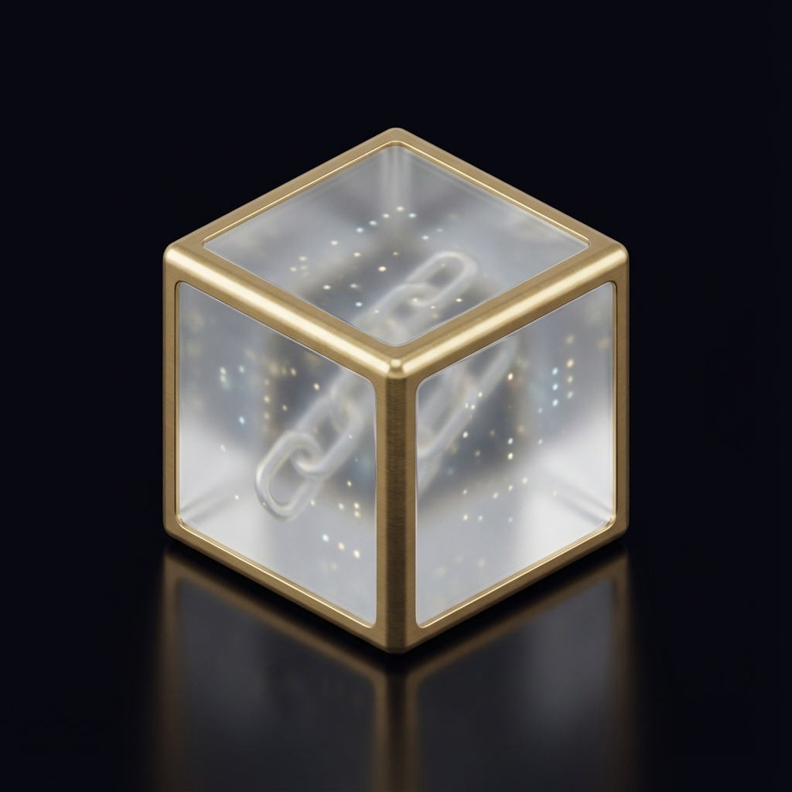

# SoloForge - Solo Bitcoin Miner

<p align="center">
  
</p>

A premium solo Bitcoin mining dashboard with a modern "Noble Materials" aesthetic. Chase the block reward with style.

## Features

- 🎰 **Solo Mining** - Connect to solo mining pools and try your luck at winning a full block reward
- 📊 **Real-time Dashboard** - Live hashrate, shares, difficulty, and worker statistics via WebSocket
- ⛏️ **Multi-Worker Support** - Run multiple mining workers simultaneously
- 🎚️ **CPU Throttling** - Control how much CPU power to dedicate to mining
- 🔧 **Configurable Pools** - Default to `solo.ckpool.org` or set your own
- 🐳 **Dockerized** - One command to run the entire stack

## Tech Stack

- **Backend**: Go 1.22 (Stratum protocol, WebSocket, REST API)
- **Frontend**: React 18 + Vite (Glassmorphism UI)
- **Infrastructure**: Docker + Docker Compose

## Quick Start

### Using Docker (Recommended)

```bash
# Clone and start
docker-compose up --build

# Open http://localhost:3000
```

### Manual Development

**Backend:**
```bash
cd backend
go mod download
go run ./cmd/soloforge
```

**Frontend:**
```bash
cd frontend
npm install
npm run dev
```

## Configuration

| Setting | Description | Default |
|---------|-------------|---------|
| Pool URL | Mining pool address | `solo.ckpool.org` |
| Pool Port | Mining pool port | `3333` |
| CPU % | Maximum CPU usage | `80%` |
| Workers | Number of mining threads | `1` |

## API Endpoints

| Method | Endpoint | Description |
|--------|----------|-------------|
| GET | `/api/status` | Miner status |
| GET | `/api/stats` | Mining statistics |
| GET | `/api/history` | Share history |
| GET/POST | `/api/workers` | Worker management |
| GET/PUT | `/api/config` | Configuration |
| POST | `/api/mining/start` | Start mining |
| POST | `/api/mining/stop` | Stop mining |
| WS | `/ws` | Real-time stats |

## Screenshots

The dashboard features a premium dark theme with glassmorphism effects:
- Frosted glass stat cards
- Gold accent gradients
- Smooth animations
- 3D rendered icons

## Disclaimer

⚠️ Solo mining Bitcoin with a CPU is essentially a lottery. The probability of finding a block is extremely low. This project is for educational purposes and to experience the thrill of the chase.

Current block reward: **3.125 BTC** (~$150,000 USD)

## License

MIT
